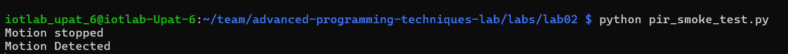

# Advanced Programming Techniques Lab
## Team Information
Members: 
Marios Ioannis Papadopoulos 1092834
Filippos Theologos 1092633
Xristina Tzouda 1097346

---
# SECTION A - RUNBOOK
# Part A — Understanding the sensor device
## Nesessary hardware 
-   Raspberry Pi 5
-   HC-SR501 PIR motion sensor
-   Jumper wires(female to female)

## PIR Sensor Pins
-   VCC: +4.5V to 20V DC input 
-   OUT: 3.3V logic output:
  - 1.LOW = no motion detected
  - 2.HIGH = motion detected 
- GND: ground

# Part B — Raspberry Pi GPIO basics 
## which pins to use on the Raspberry PI 5
1. Power pins:
  - 5V pins (physical pins 2 and 4)
  - 3.3V pin (physical pin 1)
2. Ground pins (physical pins 6, 9, 14, 20, 25, 30, 34, 39)
3. GPIO pins (signal pins) 

## Wiring Diagram

    PIR Sensor        Raspberry Pi
    -----------       -------------
    VCC  -----------> 5V
    GND  -----------> GND
    OUT  -----------> GPIO17

- In this project we used :
- Physical pin 2 for VCC (5V)
- Physical pin 6 for GND (Ground)
- Physical pin 11 for OUT (GPIO17)

# Part C — Wiring the PIR sensor and verifying hardware
## Common mistakes
Following the instractions above here are some common wiring mistakes 
1. OUT connected to 5V (wrong; bypasses GPIO and can cause damage)
2. VCC connected to 3.3V (often unreliable behavior)
3. GND not connected (floating signal; random readings)
4. Using BOARD pin numbers in code while wiring by BCM (or vice versa)
## Software smoke-test
In order to run the following smoke test you must connect to the Raspberry Pi 5 using ssh, instructions are given on `lab01`.
## 0.Wait for warm-up
After powering the PIR sensor, wait 60 seconds.
During warm-up the output can be unstable: if you test too early you can confuse “warm-up noise” with “wiring problems”.
## 1.Clone Repository
``` bash
git clone <https://github.com/johnmarios/advanced-programming-techniques-lab/tree/main/labs/lab02>
cd <repository>
```
## 2. implement `pir_smoke_test.py`.
- Create a new file:
File: labs/lab02/pir_smoke_test.py
- Run the code using the commad (on the laptop connected to the rpi5):
  ``` bash
  python pir_smoke_test.py
- Expected output:
  
## 3.Debug 
1. Confirm pir = MotionSensor(pin) matches the GPIO you wired OUT to (BCM numbering).
2. Re-check VCC is on 5V, not 3.3V.
3. Re-check GND is connected.
4. Wait full warm-up.

## 4. “Play” with the sensor knobs 
1. Set TIME to minimum:
   the result should be shown within **3 seconds**
2. Set TIME to maximum:
   the result should be shown within **300 seconds (~5 minutes)**
3. Set sensitivity low and stand ~1m away and move :
   the reliable trigger distance is about **2–3 m**
4. Set  sensitivity high and repeat the process :
   the reliable trigger distance is about **5–7 m**

# Part D — Software setup
## Use a venv
As shown in lab01 we must use a Python virtual environment .
To get to the repo follow the instructions given on lab01.
On the laptop connected via ssh to rpi5 run:
```bash
python3 -m venv venv
```
Then run :
```bash
source venv/bin/activate
```
Create a `requirments.txt` inside the lab02 folder and write:
```
gpiozero==2.0.1
```

# Part E — From “signal” to “event” 
## 0. Repository Structure
 labs/lab02/
├── pirlib/
│   ├── __init__.py
│   ├── sampler.py
│   └── interpreter.py
├── pir_print.py
├── pir_event_logger.py
└── README.md

## 1.Explanation for each program
- Pirlib library.
1. `pirlib/sampler.py` : Reads raw GPIO signal (HIGH/LOW) from the Pi using gpiozero.
2. `pirlib/interpreter.py` : Applies interpretation logic (anti-spam + filtering) and returns semantic events.
- Programs
3. `pir_print.py` : Human-readable “what events am I producing?” tool.
4. `pir_event_logger.py` : As shown in lab01, JSONL logger (append-only, seq/run_id, timestamps, Ctrl-C safe).


  
# SECTION B - REPORT
## RQ1
A PIR sensor is **passive** and **no-contact**.  
It does not emit energy; it only detects changes in infrared heat from movement.

## RQ2
The output is **digital** (2 states):
- `LOW` → no motion
- `HIGH` → motion detected (~3.3V logic)

## RQ3
If `TIME = 300s`, software may wrongly assume there is **continuous motion** for 5 minutes.  
In reality, one trigger can keep the signal `HIGH` for that whole time window.

## RQ4
Warm-up matters because the first **30–60 seconds** can be unstable/noisy.  
If you log immediately, you may record false motion events.

## RQ5
By mixing BCM and BOARD numbering, there will be bugs since the pin referenced in the code will not match the physical one.

For example:

- **BCM GPIO17** = **BOARD physical pin 11**
- **BOARD physical pin 17** = **3V3 power**

## RQ6:
|Sensor pin |	Pi pin (physical) |	Pi name (BCM) |	Why      |
|-----------|---------------------|---------------|----------|
|VCC	    |	                 2|	            5V|power     |
|GND	    |	                 6|	           GND|reference |
|OUT	    |	                11|	        GPIO17|input signal|

## RQ7:
We selected GPIO17(BCM) since it has no special function, thus avoiding future conflicts.

## RQ8:


## RQ9
With TIME at minimum, OUT stayed HIGH for about **3 seconds**.

## RQ10
With TIME at maximum, OUT stayed HIGH for about **300 seconds (~5 minutes)**.

## RQ11
Reliable trigger distance:
- low sensitivity: about **2–3 m**
- high sensitivity: about **5–7 m**

## RQ12
In **H mode**, HIGH tends to stay HIGH while motion continues.
In **L mode**, HIGH stays on for one TIME window, then goes LOW even if motion continues.

## RQ13
`sys.executable` output:

`/home/iotlab_upat_6/team/advanced-programming-techniques-lab/labs/lab02/venv/bin/python`

This proves we use a venv because the Python executable is inside the lab folder's `.venv` directory (not system Python).

## RQ14
Chosen sample interval: **0.1 s**.
Reason: fast enough to catch short signals, but not too fast to create unnecessary load/noise.

## RQ15
Chosen cooldown: **5 s**.
Reason: close to PIR reset behavior (~5–6 s), so it reduces duplicate detections.

## RQ16
Observed brief spikes: **yes, mostly during warm-up**.
Chosen `min_high`: **0.2 s** to ignore short false spikes.

## RQ17
Latency for 3 records (ingest_time - event_time):
- record 1: **12 ms**
- record 2: **15 ms**
- record 3: **11 ms**

## RQ18
The interpreter prevents spam by emitting only **one motion event per HIGH window**.
It emits again only after the signal goes LOW and conditions (cooldown/min_high) are satisfied.

## RQ19
`pir_print.py` output snippet:

```text
[print] pin=17 interval=0.1s cooldown=5.0s min_high=0.2s
t=   8.42s motion_detected
t=  15.03s motion_detected
```

## RQ20
`pir_event_logger.py` output snippet:

```text
{"event_time":"2026-03-03T10:13:21.123Z","ingest_time":"2026-03-03T10:13:21.136Z","device_id":"pir-01","event_type":"motion","motion_state":"detected","seq":1,"run_id":"run-20260303-101300","pin":17,"sample_interval_s":0.1,"cooldown_s":5.0,"min_high_s":0.2}
{"event_time":"2026-03-03T10:13:27.241Z","ingest_time":"2026-03-03T10:13:27.256Z","device_id":"pir-01","event_type":"motion","motion_state":"detected","seq":2,"run_id":"run-20260303-101300","pin":17,"sample_interval_s":0.1,"cooldown_s":5.0,"min_high_s":0.2}
```

## RQ21
Add a screenshot of your board here (Backlog / In Progress / Done), e.g.:

``

## RQ22
Example coordination bug prevented by the board:
One teammate planned to use GPIO17 while another coded GPIO18.
The board task made pin choice explicit, so the mismatch was caught early.

## RQ23
Critical-path blocker: **"Wiring verified"**.
Reason: if wiring is wrong, smoke test, experiments, interpreter checks, and logger outputs are all unreliable.
