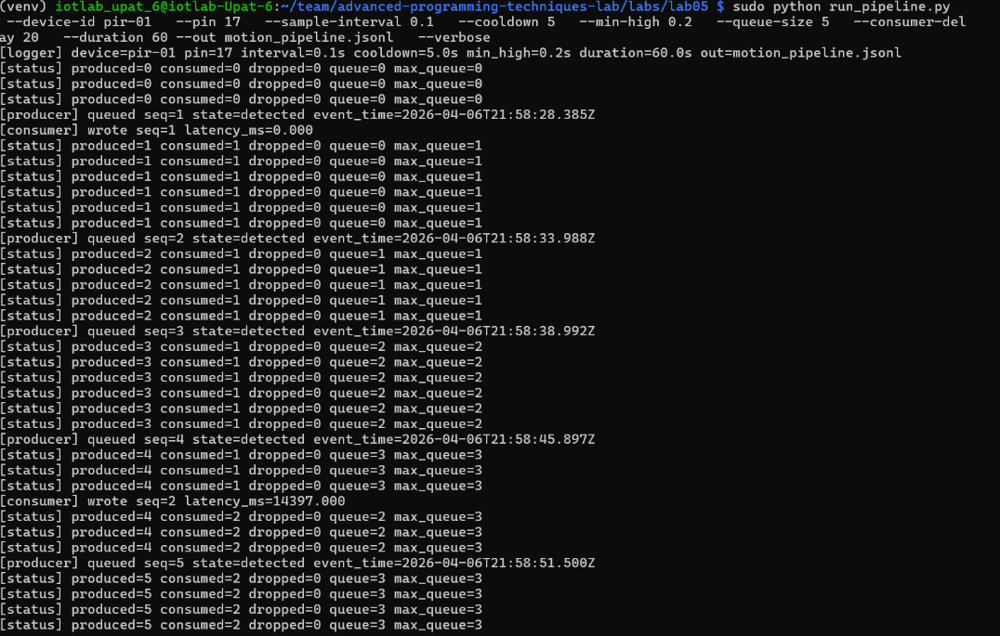
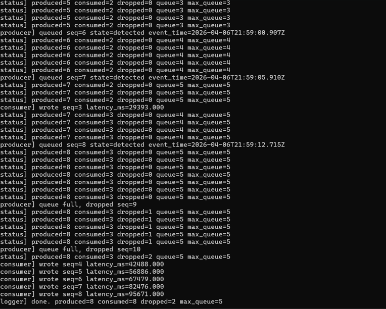
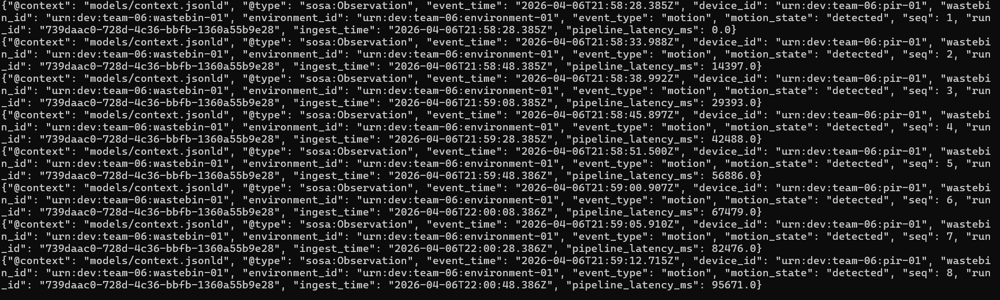
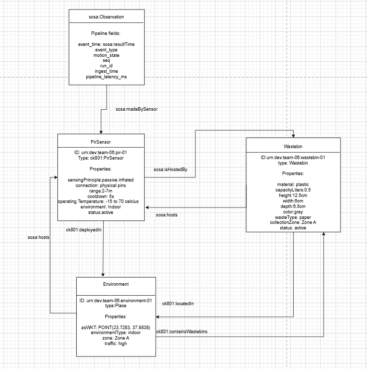

# Advanced Programming Techniques Lab
## Team Information
Members: 
- Marios Ioannis Papadopoulos 1092834
- Filippos Neofytos Theologos 1092633
- Xristina Tzouda 1097346
---
# SECTION A - RUNBOOK 
## Nesessary hardware and software from previous labs
- Hardware:
  - Raspberry Pi 5
  - HC-SR501 PIR motion sensor
  - Jumper wires(female to female)
- Wiring the sensor:
  Use the example given on lab02, made sure to connect the OUT on the same pin.
- Connection
  As shown in lab01, in order to run the following code it's nesessary to connect to the raspberry pi 5 via ssh. Clear instructions can be found on lab01.
- Software:
  - The PIR sensor logic (`sampler.py`, `interpreter.py`) is reused from Lab 02, as well as the pipeline (`run_pipeline.py`)  from lab03.
  - Use a venv just like the previous labs.
  - Create a docker like it is shown on lab04.
## Create the model files 
Using the instructions given on the lab's website we were able to write the JSON-LD documents in order to make the result data readable by everyone, just by following the links
## Create the ontopology documentation 
The Ontopoly auto-builds editing forms from your ontology. Define `Wastebin` properties once, get the right UI automatically. Like the JSON-LD `@context`.
## Update the Pipeline
- Modify `run_pipeline.py` to include the @context reference and entity links in every output record.
- Added entity normalization function (`normalize_entity_id()`) to ensure URN format
- Updated `create_event()` to accept `context_iri`, `wastebin_id`, and `environment_id` parameters
- Every output record now includes:
  - `@context`: reference to external JSON-LD context file (`models/context.jsonld`)
  - `@type`: semantic type (`sosa:Observation`)
  - Entity IRIs: device_id, wastebin_id, environment_id as proper URNs (urn:dev:team-06:*)
  - Pipeline metadata: run_id, sequence number, ingest_time, latency_ms

---

## Data Model Overview

The PIR sensor deployment is described using a **domain model** that defines relationships between four key entities:

```
Entity → Relationships → Context

PirSensor  ──deployedIn──→ Wastebin 
   │                          │
   ├──environment───→ Environment 
   │
   └──madeBySensor──→ Observation Records
                            │
                   ├──resultTime: timestamp
                   └──contextualReferences: Wastebin, Environment
```

### Entities and Properties

**1. PirSensor (ck801:PirSensor)**
- **ID**: `urn:dev:team-06:pir-01`
- **Type**: SOSA Sensor subclass
- **Key Properties**:
  - `sensingPrinciple`: passive infrared
  - `range`: 2–7 meters
  - `cooldown`: 5 seconds (detection hold-off)
  - `operatingTemperature`: −15 to 70°C
  - `pins`: GPIO.17 (wired connection)
- **Relationships**: deployed in wastebin-01, located in environment-01

**2. Wastebin (ck801:Wastebin)**
- **ID**: `urn:dev:team-06:wastebin-01`
- **Type**: ck801:Wastebin (schema.org:Product subclass)
- **Key Properties**:
  - `capacityLiters`: 0.5 L
  - `material`: plastic
  - `color`: grey
  - `wasteType`: paper
  - `collectionZone`: Zone A
- **Relationships**: hosts pir-01, located in environment-01

**3. Environment (bot:Space)**
- **ID**: `urn:dev:team-06:environment-01`
- **Type**: Building Topology Ontology Space
- **Key Properties**:
  - `environmentType`: indoor
  - `zone`: Zone A
  - `traffic`: high (busy area)
  - `location`: Kypes classroom (23.7283°N, 37.9838°E)
- **Relationships**: hosts pir-01, contains wastebin-01

### Observation Records Structure

Every motion detection event is captured as an `sosa:Observation` with semantic markup:

```json
{
  "@context": "models/context.jsonld",
  "@type": "sosa:Observation",
  "event_time": "2026-04-06T14:30:45.123Z",
  "device_id": "urn:dev:team-06:pir-01",
  "wastebin_id": "urn:dev:team-06:wastebin-01",
  "environment_id": "urn:dev:team-06:environment-01",
  "event_type": "motion",
  "motion_state": "detected",
  "seq": 1,
  "run_id": "a1b2c3d4-e5f6-...",
  "ingest_time": "2026-04-06T14:30:45.150Z",
  "pipeline_latency_ms": 27.5
}
```

**Key Fields Explained:**
- `@context`: Points to `models/context.jsonld`, which maps field names to ontology terms (for example sosa:resultTime, sosa:madeBySensor, pipeline:eventType).
- `@type`: Declares this record as a SOSA Observation (semantic self-description)
- Entity IRIs: device_id, wastebin_id, environment_id are URNs, enabling linking to their JSON-LD definitions
- Pipeline metadata: seq, run_id, ingest_time, latency_ms track event flow and performance

### Running the Pipeline with Models

Execute the pipeline with explicit entity references:

```bash
python labs/lab05/run_pipeline.py \
  --device-id urn:dev:team-06:pir-01 \
  --wastebin-id urn:dev:team-06:wastebin-01 \
  --environment-id urn:dev:team-06:environment-01 \
  --context models/context.jsonld \
  --pin 17 \
  --duration 60.0 \
  --out events.jsonl
```

Each line in `events.jsonl` will now be **self-describing**: a reader can:
1. See it's a SOSA Observation (via `@type`)
2. Look up term definitions in the referenced `@context`
3. Follow entity IRIs to `models/sensor.jsonld`, `models/wastebin.jsonld`, `models/environment.jsonld`
4. Understand the complete deployment context without external documentation

## Pipeline Outputs (Execution Screenshots)

Run command used:

```bash
sudo python run_pipeline.py \
  --device-id pir-01 \
  --pin 17 \
  --sample-interval 0.1 \
  --cooldown 5 \
  --min-high 0.2 \
  --queue-size 5 \
  --consumer-delay 20 \
  --duration 60 \
  --out motion_pipeline.jsonl \
  --verbose
```

Output screenshots:







JSON output:




## What The JSON Output Shows

Use this section to explain what each JSON field means and what the run demonstrates.

```json
{
  "@context": "models/context.jsonld",
  "@type": "sosa:Observation",
  "event_time": "2026-04-06T...Z",
  "device_id": "urn:dev:team-06:pir-01",
  "wastebin_id": "urn:dev:team-06:wastebin-01",
  "environment_id": "urn:dev:team-06:environment-01",
  "event_type": "motion",
  "motion_state": "detected",
  "seq": 1,
  "run_id": "...",
  "ingest_time": "2026-04-06T...Z",
  "pipeline_latency_ms": 0.0
}
```

- `@context`: Maps JSON keys to semantic terms.
- `@type`: Declares that each line is a SOSA Observation.
- `event_time`: Time the event was produced by the sensor path.
- `ingest_time`: Time the event was consumed/written to disk.
- `pipeline_latency_ms`: Delay between producer and consumer.
- `seq`: Event order within one run.
- `run_id`: Unique ID for this execution.
- `event_type` and `motion_state`: Human-readable motion meaning.
- `device_id`, `wastebin_id`, `environment_id`: Links each observation to known entities.

Interpretation notes from this run:
- Queue builds up over time (`max_queue=5`) because consumer delay is high.
- Once queue is full, events are dropped (`dropped=2`).
- Latency increases for later events as backlog grows.
- The JSONL file preserves both semantic context and runtime behavior metrics.


## Entity Diagram



  


# SECTION B - REPORT
**RQ1:**  
We used three vocabularies across our models:
- SOSA/SSN (http://www.w3.org/ns/sosa/) — purpose-built for sensors, observations, and actuators. It has exact concepts like Sensor, Observation, ObservableProperty, and resultTime that map directly to our PIR sensor setup. Alternatives like SAREF are also suitable but less widely supported by open tools.
- schema.org (https://schema.org/) — for general metadata: name, description, manufacturer, Place. It's the most widely understood vocabulary on the web, making our models more accessible.
- BOT (https://w3id.org/bot#) — the Building Topology Ontology, designed specifically for describing spatial relationships between rooms, floors, and buildings. Used in environment.jsonld.
- Custom pipeline: namespace — for pipeline-internal fields (seq, run_id, pipeline_latency_ms) that no standard vocabulary covers.

**RQ2:**  
From the properties included in our sensor description, in standard vocabularies belong the following:    
`@type` (sosa:Sensor),  
`name`,   
`description`,  
`sosa:isHostedBy`.   

While custom properties defined in our namespace include:  
`ck801:range`,   
`ck801:cooldown`,   
`ck801:pins`,   
`ck801:operatingTemperature`,   
`ck801:sensingPrinciple`.  
 
**RQ3:**   
The wastebin model includes properties such as  `capacity`, `material`, `dimensions`, `waste type`, `zone`, `status`. Properties like `fill level`, `maintenance history`, and `battery level` were excluded because they are either dynamic or require additional sensors. The selected properties focus on static or directly observable characteristics.
 
**RQ4:** 
- Sensor: `sosa:isHostedBy` → wastebin, `ck801:deployedIn` → environment
- Wastebin: `sosa:hosts` → sensor, `ck801:locatedIn` → environment  
- Environment: `sosa:hosts` → sensor, `ck801:containsWastebins` → wastebin
 
**RQ5:**   
Some properties, such as cooldown, GPIO pins, and sensing principle, are not covered by standard vocabularies. Therefore, they were defined in a custom `ck801` namespace and documented in `docs/ontology.md`.

 
### Context & Namespace
 
**RQ6:**  
`event_time` → `sosa:resultTime` (SOSA standard for observation time). `device_id` → `sosa:madeBySensor` (SOSA links observation to sensor). Custom fields like `pipeline_latency_ms` → `pipeline:latencyMs` (pipeline-internal metrics need custom terms).
 
**RQ7:**  
Used `https://github.com/johnmarios/advanced-programming-techniques-lab/blob/main/docs/ontology.md#`. Persistent GitHub URL is resolvable; trailing `#` allows fragment-based term references.
 
**RQ8:**  
Before: `"event_time": "2026-04-10T14:32:01.123Z"` was ambiguous (sensor time? processing time?). After mapped to `sosa:resultTime`—standard W3C term meaning "observation result time." Any SOSA-aware tool now understands it automatically.
 
**RQ9:**   
The `@context` maps property names to well-defined URIs and provides semantic meaning. Without it, JSON data may be valid but lacks interpretation. With @context, the data becomes self-describing and can be correctly understood by machines.
 
**RQ10:**  
Used external reference: `"@context": "models/context.jsonld"`. Trade-off: smaller file size vs. requires file access. Alternative: inline every record (portable, large). Alternative: once at start (non-standard JSONL).
 
### The Diagram
 
**RQ11:** 
The diagram shows four layers: Environment (location), Wastebin (container), Sensor (device), and Observation (event). These entities are connected through semantic relationships such as sosa:madeBySensor, sosa:isHostedBy, and ck801:locatedIn. Each entity is identified using @id URNs, allowing them to reference each other. The Observation links to the Sensor, which is hosted by a Wastebin and deployed within an Environment, forming a connected data model.

 
### Interoperability & Extensibility
 
**RQ12:**  
Yes, but with some limitations. If both teams use the same JSON-LD context and ontology, the application can process their data in the same way, since the structure and meaning are consistent. However, it cannot assume sensor-specific details such as accuracy or range, so it may need to check additional metadata via the @id.

 
**RQ13:**  
First the model of the ultrasonic sensor `models/distance-sensor.jsonld` must be created. After that the current JSON-LD files need to be updated:  
wastebin: add second `sosa:hosts` entry and `ck801:currentFillLevel`.   
context: add `fill_level` → `pipeline:fillLevelPercent`.  
And finally in `docs/ontology.md`: document new term. Environment and PIR sensor unchanged.
 
**RQ14:**  
Missing: maintenance history (when was sensor last serviced?), battery level (when will sensor die?), asset IDs (for accounting), calibration dates (data quality), firmware version (for debugging).
 
**RQ15:**  
SAREF4WASTEMANAGEMENT is purpose-built for waste systems (collection routes, rich measurements). Our model is simpler, more educational, extensible. SAREF includes `saref:accuracy`, `saref:uncertainty`; we omit statistical metadata.
 
### Reflection
 
**RQ16:**  
Raw Lab 03 JSONL sits at DATA level (raw facts, no context). JSON-LD version sits at INFORMATION level (contextualized with relationships and metadata). Semantic annotation + entity linking moved it up.
 
**RQ17:**  
Data that works is data that follows the correct structure, so a system can process it without errors. However, it may not clearly express what it represents. Data that communicates information goes beyond structure by adding meaning and context, making it clear what the data describes. The key difference is that working data is syntactically correct, while informative data is semantically meaningful.
 
**RQ18:**  
The pipeline now produces “better” data because it no longer outputs just raw values, but also includes information about what those values mean. The data is more structured and provides context, making it easier to understand and use. As a result, both people and systems can interpret it correctly, leading to fewer errors and more useful outcomes.

 


