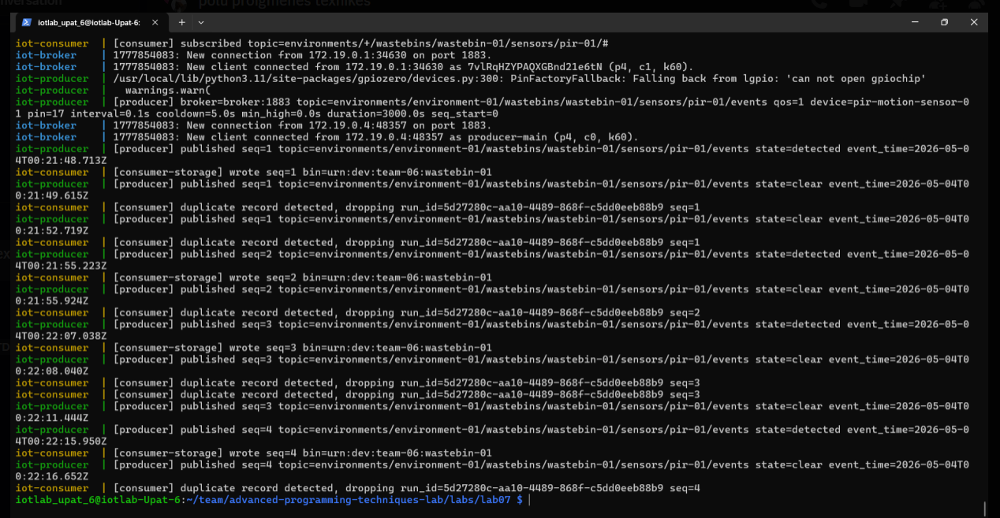
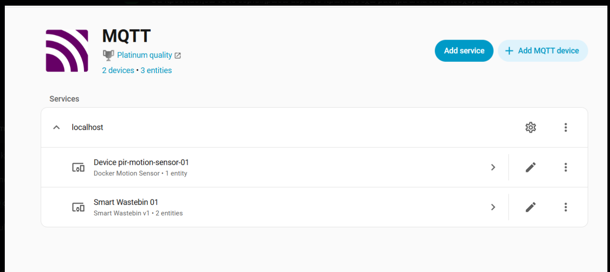
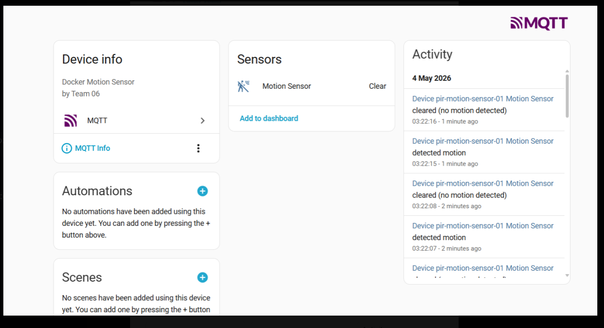
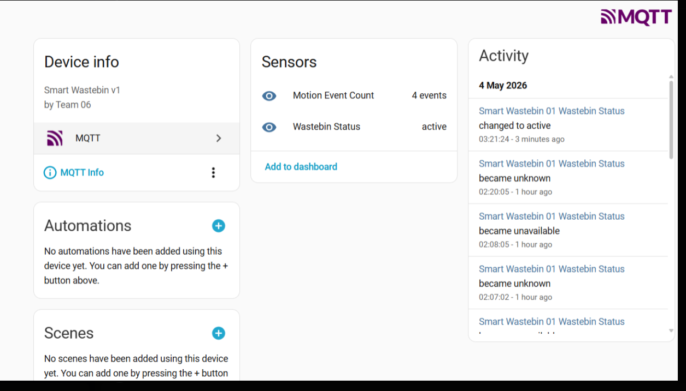
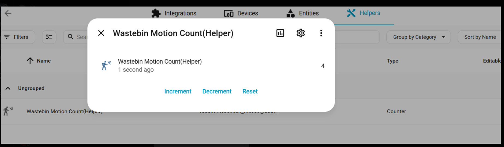
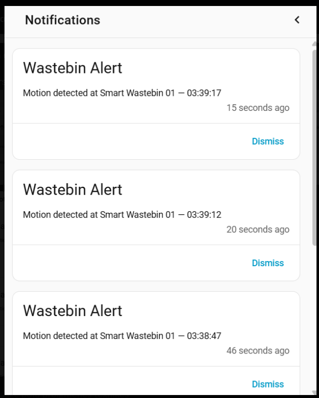
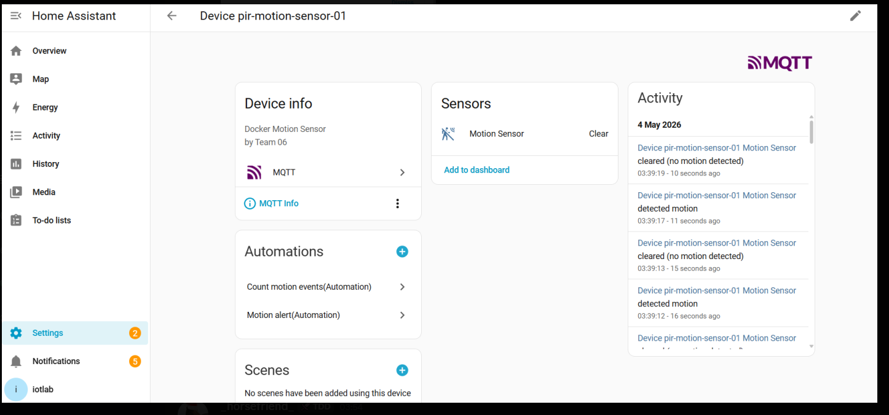
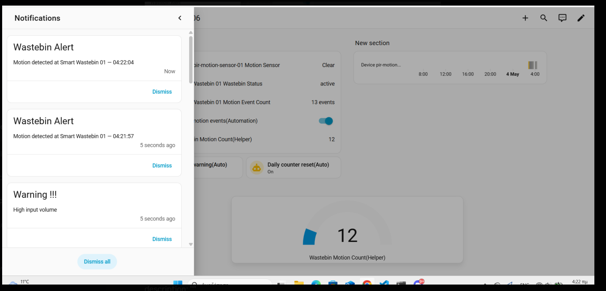
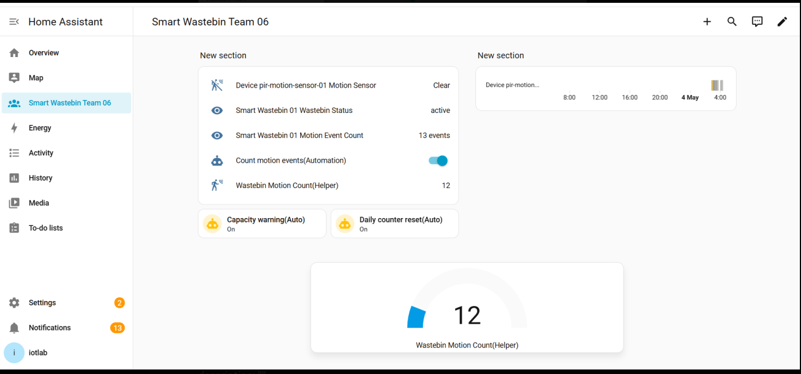

# Advanced Programming Techniques Lab
## Team Information
Members: 
- Marios Ioannis Papadopoulos 1092834  
- Filippos Neofytos Theologos 1092633  
- Xristina Tzouda 1097346

---
# SECTION A - RUNBOOK 
## Nesessary hardware and software from previous labs
- Hardware:
  - Raspberry Pi 5
  - HC-SR501 PIR motion sensor
  - Jumper wires(female to female)
- Wiring the sensor:
  Use the example given on lab02, made sure to connect the OUT on the same pin.
- Connection
  Due to bad connection, we weren't able to download `homeassistant` during lab time and by using ssh, so we worked on the raspberry.
- Software:
  - The PIR sensor logic (`sampler.py`, `interpreter.py`) is reused from Lab 02 and placed inside `pirlib/`. 
  - Use a venv just like lab01 and lab02.
  - Make sure to inastall a `requirments.txt`.
  - Install Mosquitto brocker. Instructions givel on lab06
## Part 1 — Run Home Assistant in Docker
1. Create a directory for Home Assistant configuration:
```
mkdir -p ~/homeassistant/config
```
2. Run home assistant:
```
docker run -d \
  --name homeassistant \
  --restart unless-stopped \
  -v ~/homeassistant/config:/config \
  -v /run/dbus:/run/dbus:ro \
  --network host \
  ghcr.io/home-assistant/home-assistant:stable
```
3. When it starts run :
```
docker logs -f homeassistant
```
4. We run it directly on the raspberry so we used the following line on the browser `http://localhost:8123`.
## Part 2 — Connect Home Assistant to your MQTT broker
- Create the Mosquitto configuration file:
```
sudo nano /etc/mosquitto/conf.d/default.conf
```
- Add:
```
listener 1883
allow_anonymous true
```
- Restart Mosquitto:
```
sudo systemctl restart mosquitto
```
- Then we followed the instructions given on the lab course in order to add the MQTT on home assistant.
## Verifying the connection
- Follow this path on the home assistant :
  - Settings → Devices & Services → MQTT
- Subscribe to # (meaning all topics)
- Publish the:
  - Topic : `test/ha`
  - Payload: **hello from Home Assistant**
- The payload should be visible
- Publish from the terminal:
  - `mosquitto_pub -h localhost -t "test/from-terminal" -m "hello from terminal"`
- It showed up in the Home Assistant MQTT listener, so the bridge is working.
## Part 3 — Understand MQTT Discovery
## Create motion sensor entity:
1. Publish a configuration message to `homeassistant/binary_sensor/pir_01_motion/config`
2. Write the following payload:
```
{
  "name": "PIR Motion Sensor",
  "state_topic": "smartbin/bin-01/pir-01/motion",
  "payload_on": "detected",
  "payload_off": "clear",
  "device_class": "motion",
  "unique_id": "pir_01_motion",
  "device": {
    "identifiers": ["pir-01"],
    "name": "PIR Sensor 01",
    "model": "HC-SR501",
    "manufacturer": "Generic"
  }
}
```
This tells the home assistant to create a binary sensor, something that is On or OFF. It also says that the if the topic receives "detected", the entity is ON and if  it receives "clear", it is OFF. 
Try it from terminal:
```
mosquitto_pub -h localhost -t "homeassistant/binary_sensor/pir_01_motion/config" -r -m '{
  "name": "PIR Motion Sensor",
  "state_topic": "smartbin/bin-01/pir-01/motion",
  "payload_on": "detected",
  "payload_off": "clear",
  "device_class": "motion",
  "unique_id": "pir_01_motion",
  "device": {
    "identifiers": ["pir-01"],
    "name": "PIR Sensor 01",
    "model": "HC-SR501",
    "manufacturer": "Generic"
  }
}'
```
- Publish a state update:
```
mosquitto_pub -h localhost -t "smartbin/bin-01/pir-01/motion" -m "detected"
```
A new entity is visible **PIR motion sensor** showing **detected**.

- Publish a second state update but instead of `detected` write `clear`. The same result shoud be shown.

## Part 4 — Create the Smart Wastebin entity
- We created the `PIR motion sensor` in part 3.
- Create the wastebin by typing this:
```
mosquitto_pub -h localhost -t "homeassistant/sensor/wastebin_01_status/config" -r -m '{
  "name": "Wastebin Status",
  "state_topic": "smartbin/bin-01/status",
  "value_template": "{{ value_json.state }}",
  "json_attributes_topic": "smartbin/bin-01/status",
  "unique_id": "wastebin_01_status",
  "device": {
    "identifiers": ["bin-01"],
    "name": "Smart Wastebin 01",
    "model": "Smart Wastebin v1",
    "manufacturer": "ECE CK801 Team"
  }
}'
```
Then publish state with attributes: 
```
mosquitto_pub -h localhost -t "smartbin/bin-01/status" -m '{
  "state": "active",
  "location": "Lab Room 101",
  "last_motion": "2026-04-10T14:32:01Z",
  "total_events_today": 42
}'
```
- Create a motion event counter :
```
mosquitto_pub -h localhost -t "homeassistant/sensor/wastebin_01_motion_count/config" -r -m '{
  "name": "Motion Event Count",
  "state_topic": "smartbin/bin-01/pir-01/event_count",
  "unit_of_measurement": "events",
  "icon": "mdi:motion-sensor",
  "unique_id": "wastebin_01_motion_count",
  "device": {
    "identifiers": ["bin-01"],
    "name": "Smart Wastebin 01"
  }
}'
```
- We also created a helper counter, that runs in the home assistant called **Wastebin Motion Count**
## Part 5 — Publish from your pipeline
We changed the code on the `producer.py` and got the following results:





## Part 6 — Create a motion counter with automations
- Following the steps given on the lab website we created the helper counter running on the home assistant app named **Wastebin Motion Count**
- The results:




## The YAML we created 
```
alias: Motion alert(Automation)
description: ""
triggers:
  
trigger: state
  entity_id:
binary_sensor.device_pir_motion_sensor_01_motion_sensor
to:
"on"
conditions: []
actions:
  
action: persistent_notification.create
  metadata: {}
  data:
    message: Motion detected at Smart Wastebin 01 — {{ now().strftime('%H:%M:%S') }}
    title: Wastebin Alert
mode: single
-------------------------------
alias: Daily counter reset(Auto)
description: ""
triggers:
  
trigger: time_pattern
  hours: "0"
  minutes: "00"
  seconds: "00"
conditions: []
actions:
  
action: counter.reset
  metadata: {}
  target:
    entity_id: counter.wastebin_motion_count_helper
  data: {}
mode: single
--------------------------------
alias: Count motion events(Automation)
description: ""
triggers:
  
trigger: state
  entity_id:
binary_sensor.device_pir_motion_sensor_01_motion_sensor
to:
"on"
conditions: []
actions:
  
action: counter.increment
  metadata: {}
  target:
    entity_id: counter.wastebin_motion_count_helper
  data: {}
mode: single
-------------
alias: Capacity warning(Auto)
description: ""
triggers:
  
trigger: numeric_state
  entity_id:
counter.wastebin_motion_count_helper
above: 10
conditions: []
actions:
  
action: persistent_notification.create
  metadata: {}
  data:
    title: Warning !!!
    message: High input volume
mode: single
```

##  Part 7 — Build a simple dashboard
Our dashboard:


# SECTION B - REPORT
## RQ1


