# Advanced Programming Techniques Lab

## Team Information

Members:

- Marios Ioannis Papadopoulos 1092834  
- Filippos Neofytos Theologos 1092633  
- Xristina Tzouda 1097346

---

# SECTION A - RUNBOOK

## Nesessary hardware and software from previous labs

- Hardware:
  - Raspberry Pi 5
  - HC-SR501 PIR motion sensor
  - Jumper wires(female to female)
- Wiring the sensor:
  Used the example given on lab02, made sure to connect the OUT on the same pin.
- Connection
  Due to bad connection, we weren't able to download `homeassistant` during lab time and by using ssh, so we worked on the raspberry.
- Software:
  - The PIR sensor logic (`sampler.py`, `interpreter.py`) is reused from Lab 02 and extended with taking in consideration the off/clear state and placed it inside `pirlib/`.
  - Installed Mosquitto brocker. Instructions givel on lab06
  - Installed Home Assistant and made our own dashboard.

## Part 1 — Set up Flask and Flask-RESTx

1. Write on requirments.txt:

```
flask
flask-restx
```

2. Install:

```
pip install flask flask-restx
```

3. By writing the code given on lab's website we made sure that API works and got the following result:


## Part 2 — Design your API
Our API design:


## Part 3 — Implement the data endpoints
Using the information from lab05 we loaded the data and followed the intructions given on the lab website.

## Part 4 — Add MQTT endpoints
We connected the API to our MQTT broker in order to be able to publish messages and read topic state through plain HTTP requests.

## Part 5 — Document your MQTT interface with AsyncAPI
A screenshot of our rendered AsyncAPI documentation follows
## Screenshots from our API
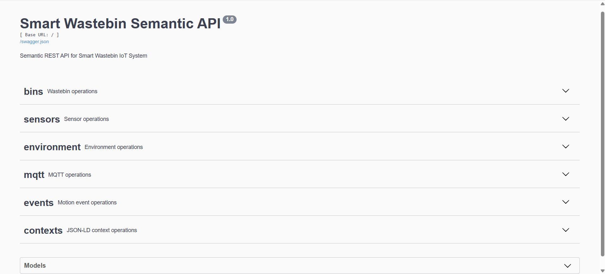
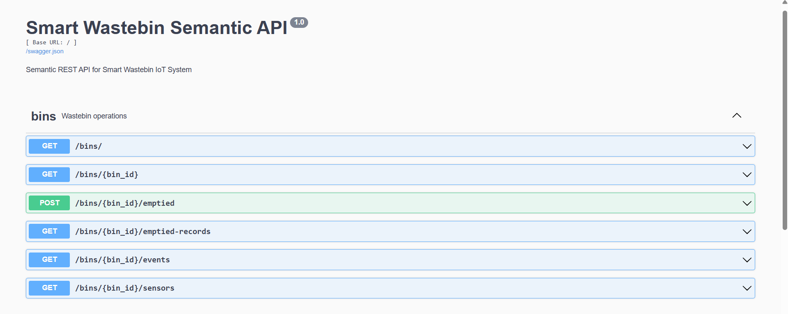
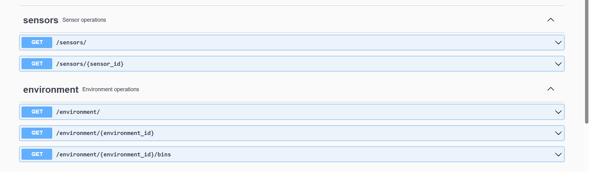
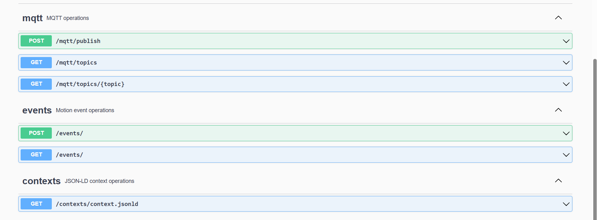
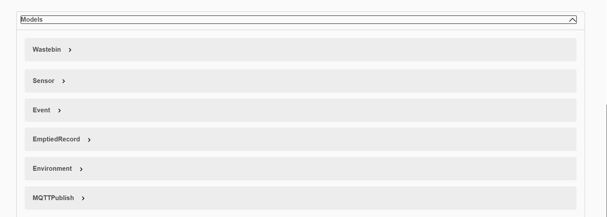
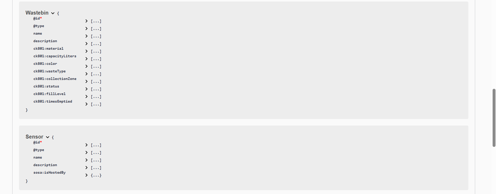
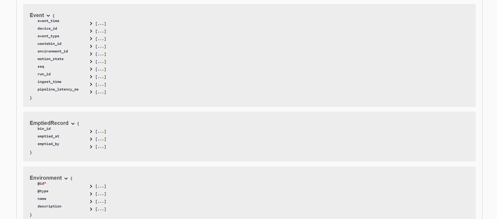
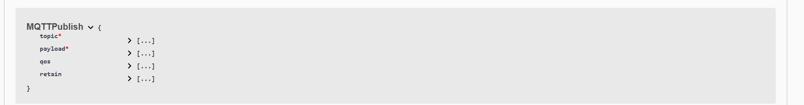
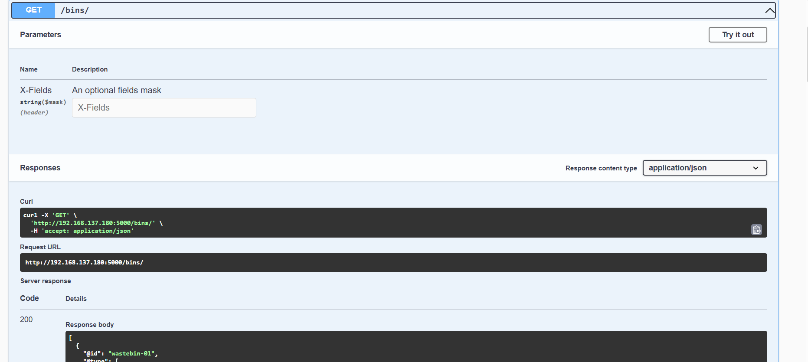
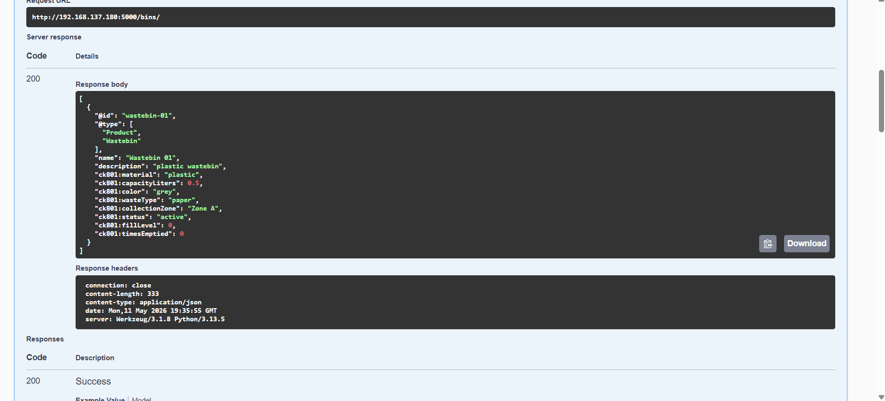
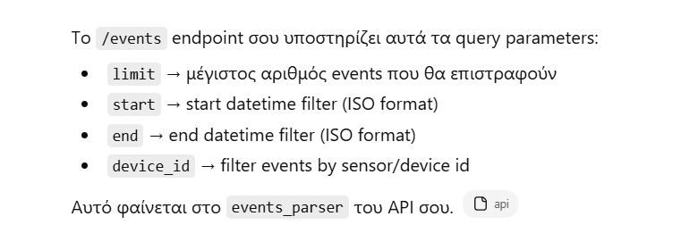
## Part 6 — Test with Swagger UI and curl
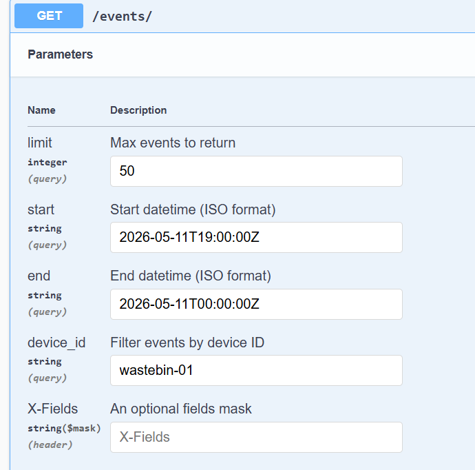
We use some of these parameters in every example, acording to the command.
## Test the curl:


# SECTION B - REPORT
## RQ1
| Method | URI | Παράμετροι | Επιστρέφει |
|--------|-----|------------|------------|
| GET | `/contexts/context.jsonld` | — | JSON-LD context |
| GET | `/bins/` | — | Λίστα με όλα τα wastebins |
| GET | `/bins/<bin_id>` | `bin_id` (path) | Ένα wastebin ή 404 |
| GET | `/bins/<bin_id>/sensors` | `bin_id` (path) | Λίστα sensors του bin |
| GET | `/bins/<bin_id>/events` | `bin_id` (path), `limit`, `start`, `end`, `device_id` (query) | Λίστα events του bin |
| POST | `/bins/<bin_id>/emptied` | `bin_id` (path), `emptied_at`, `emptied_by` (body) | Εγγραφή emptied ή 404 — 201 |
| GET | `/bins/<bin_id>/emptied-records` | `bin_id` (path) | Ιστορικό αδειασμάτων του bin |
| GET | `/sensors/` | — | Λίστα με όλους τους sensors |
| GET | `/sensors/<sensor_id>` | `sensor_id` (path) | Ένας sensor ή 404 |
| GET | `/environment/` | — | Λίστα environments |
| GET | `/environment/<environment_id>` | `environment_id` (path) | Ένα environment ή 404 |
| GET | `/environment/<environment_id>/bins` | `environment_id` (path) | Bins του environment |
| GET | `/events/` | `limit`, `start`, `end`, `device_id` (query) | Λίστα motion events |
| POST | `/events/` | `device_id`, `event_type`, `wastebin_id` (body, υποχρεωτικά) | Αποθηκευμένο event — 201 |
| POST | `/mqtt/publish` | `topic`, `payload` (υποχρεωτικά), `qos`, `retain` (body) | Επιβεβαίωση δημοσίευσης — 200 |
| GET | `/mqtt/topics` | — | Όλα τα αποθηκευμένα MQTT topics |
| GET | `/mqtt/topics/<topic>` | `topic` (path) | Τελευταίο μήνυμα του topic ή 404 |
## RQ2
Event-listing endpoints use GET because they only retrieve data and do not change anything on the server. GET is safe and idempotent.
## RQ3
The “mark as emptied” endpoint uses POST because it performs an action that may create side effects or new records. POST is suitable for non-idempotent operations, unlike PUT.
## RQ4
For bins:
```
class Bin(Resource):
    def get(self, bin_id):
        bins = load_json(BINS_FILE)

        for bin_item in bins:
            if bin_item["@id"] == bin_id:
                return bin_item

        api.abort(404, f"Wastebin {bin_id} not found")
```
For sensors:
```
class Sensor(Resource):
    def get(self, sensor_id):
        sensors = load_json(SENSORS_FILE)

        for sensor in sensors:
            if sensor["@id"] == sensor_id:
                return sensor

        api.abort(404, f"Sensor {sensor_id} not found")
```
- We chose 404 because the request itself is valid, the ID is well-formed, but no resource exists at that URI. This correctly signals "resource not found" rather than a bad request (400) or server error (500), and tells the client not to retry with the same ID.

## RQ5
PIR Sensor
    → MQTT broker (smartbin/#)
        → on_message() → topic_store (in-memory)
            → POST /events → motion_events.jsonl
                → GET /events → load_events() → JSON response

## RQ6
| Parameter   | Type    | Default | Description                             |
|------------ |---------|---------|----------------------------------------|
| `limit`     | integer | `50`    | Max number of events to return          |
| `start`     | string  | —       | Filter events after this ISO timestamp  |
| `end`       | string  | —       | Filter events before this ISO timestamp |
| `device_id` | string  | —       | Filter by sensor ID                     |
 
These apply to both `GET /events` and `GET /bins/<bin_id>/events`.

## RQ7
`api.model` in Flask-RESTx defines the structure of request and response data. These models are automatically used to generate the Swagger UI documentation.
When we add a new field to a model, the Swagger UI updates automatically to show the new field in the endpoint documentation, including type and description.
## RQ8


## RQ9
`POST /mqtt/publish` receives a topic and message from an HTTP request and publishes the message to the MQTT broker.
## RQ10
The HTTP request is sent to the API → the API publishes the message to the MQTT broker → subscribers receive the message → the consumer stores it in the JSONL file.
## RQ11
`GET /mqtt/topics` returns the MQTT topics the API has received or subscribed to. The subscription to `smartbin/#` is needed so the API can listen to all topics under *smartbin*.
## RQ12
Combining database storage and MQTT publishing in one endpoint ensures an event is permanently saved and immediately shared with  any other systems in real time.
## RQ13
AsyncAPI documents event-driven (MQTT) communication, while OpenAPI documents REST endpoints. We need both because a Smart Wastebin project like ours uses REST for control and actions, while using  MQTT for real-time events.

## RQ14
The AsyncAPI specification documents 3 MQTT channels:

| Channel | Publisher | Subscriber |
|---|---|---|
| `environments/environment-01/wastebins/wastebin-01/sensors/pir-01/events` | PIR motion event producer | Motion event consumer |
| `smartbin/{bin_id}/{sensor_id}/motion` | PIR producer | Home Assistant / MQTT clients |
| `smartbin/{bin_id}/status` | Flask API / wastebin status publisher | MQTT subscribers and dashboard clients |

Description of each channel:

1. **motionEvents**  
   Publishes full JSON motion observation events generated by the PIR sensor producer.  
   The consumer subscribes to this topic, enriches the events with metadata, and stores them in a JSONL file.

2. **motionState**  
   Publishes simplified motion state messages (`detected` or `clear`) for Home Assistant integration and lightweight MQTT clients.

3. **binStatus**  
   Publishes retained wastebin status updates such as `active`, `emptied`, or `maintenance`.
## RQ15
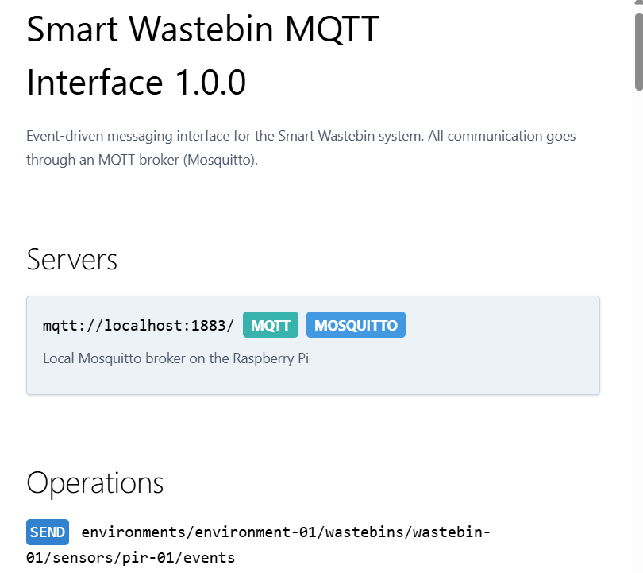
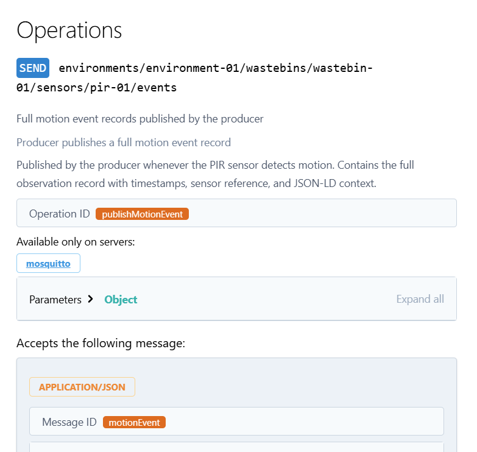
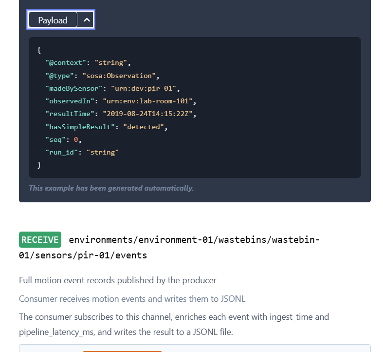
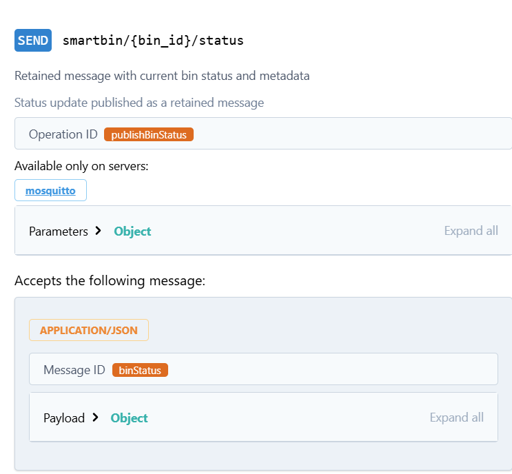
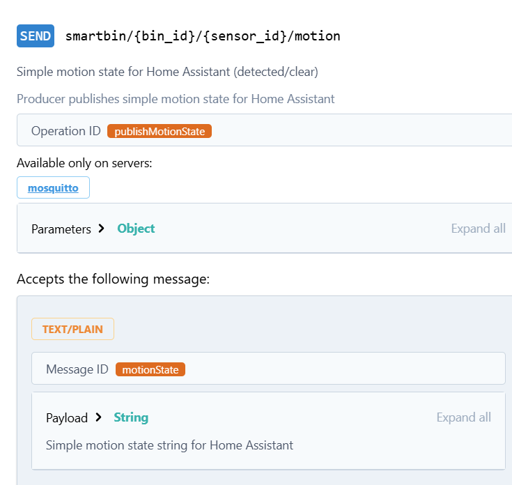

## RQ16
| Aspect | `event_model` (Flask-RESTx) | `MotionEvent` (AsyncAPI) |
|---     |---                          |---                       |
| **Purpose** | Validates & documents the HTTP REST API | Documents the MQTT message schema |
| **Context** | Used in `POST /events` and `GET /events` | Used when a sensor publishes to an MQTT topic |
| **Transport** | HTTP (request/response) | MQTT (publish/subscribe) |
| **Trigger** | A client explicitly calls the API | A sensor autonomously fires an event |
| **Direction** | Two-way (POST to ingest, GET to retrieve) | One-way (sensor → broker → subscriber) |
 
- The fields overlap (`device_id`, `event_time`, `motion_state`), but `event_model` serves a pull-based REST context while `MotionEvent` serves a push-based async context.

## RQ19
We would give them the Swagger UI (OpenAPI) for REST endpoints and the AsyncAPI spec for MQTT events. Swagger shows how to read and update bin data and report when bins are full, while AsyncAPI shows real-time bin status updates via MQTT topics.
## RQ20
The system needs REST for actions like reporting bins and fetching data and MQTT for real-time updates, like sensor events.If we only used REST, there would be no real-time updates and If we used MQTT alone , users couldn’t easily request or manage data on demand.
