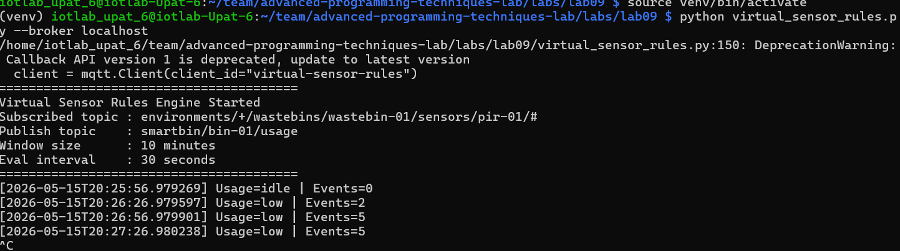
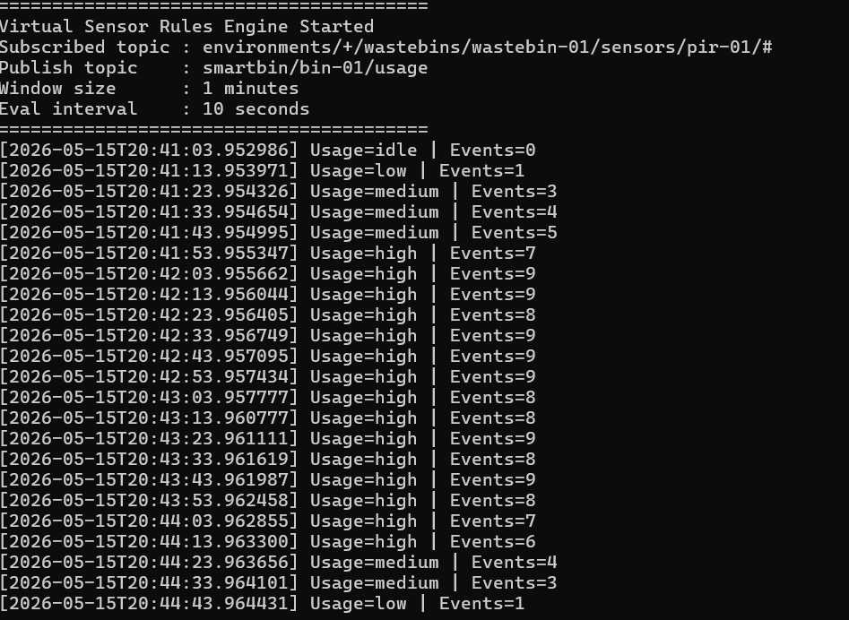
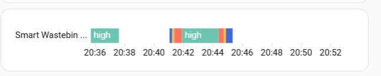
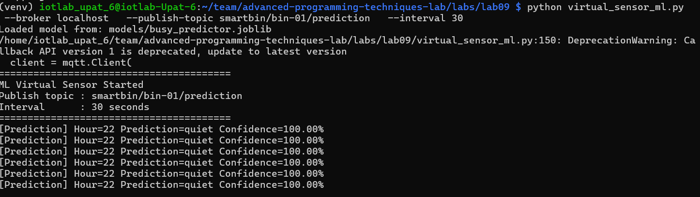
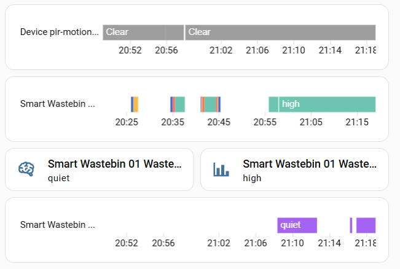
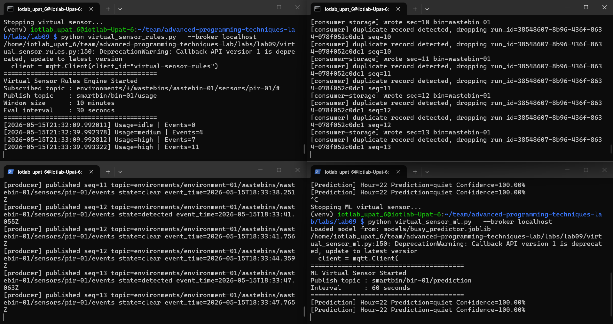
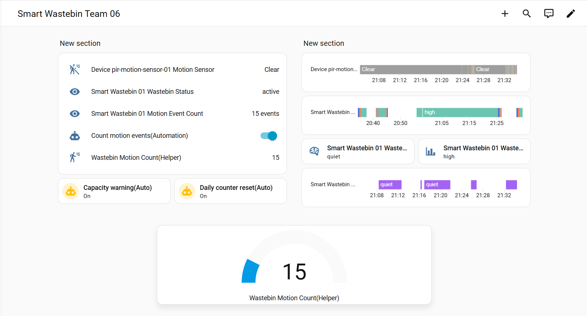

# Advanced Programming Techniques Lab

## Team Information

Members:

- Marios Ioannis Papadopoulos 1092834  
- Filippos Neofytos Theologos 1092633  
- Xristina Tzouda 1097346

---

# SECTION A - RUNBOOK

## Nesessary hardware and software from previous labs

- Hardware:
  - Raspberry Pi 5
  - HC-SR501 PIR motion sensor
  - Jumper wires(female to female)
- Wiring the sensor:
  Use the example given on lab02, made sure to connect the OUT on the same pin.
- Connection
  Due to bad connection, we weren't able to download `homeassistant` during lab time and by using ssh, so we worked on the raspberry.
- Software:
  - The PIR sensor logic (`sampler.py`, `interpreter.py`) is reused from Lab 02 and extended with taking in consideration the off/clear state and placed it inside `pirlib/`.
  - Install Mosquitto brocker. Instructions givel on lab06
  - Installed Home Assistant and made our own dashboard.
  - Created our own API. Details given on lab08

## Part 1 — Rule-based virtual sensor: bin usage intensity

Following the intructions given on the lab website, we created a rule-based virtual sensor that calculates the bin usage intensity based on the PIR sensor data. We used th following rules:

### Rule 1 — Motion Detection

- When the PIR sensor publishes a "detected" state, the current timestamp is added to the queue.

### Rule 2 — Time Window

- Any event older than the window (default 10 minutes) is discarded before counting.

### Rule 3 — Usage Classification

- count == 0 : "idle"
- 1 <= count <= 2 : "low"
- 3 <= count <= 5 : "medium"
- count > 5 : "high"

### Rule 4 — Availability Publishing

- Home Assistant is notified whether the sensor is online or offline.

### Εxample of the output

- First example:

1. Count < 5 & every 30 seconds: "bin_usage_intensity: low"
2. Count < 10 & every 30 seconds: "bin_usage_intensity: medium"
3. Count > 10 & every 30 seconds: "bin_usage_intensity: high



- Second example:

Run the following command :

```bash
python virtual_sensor_rules.py \
  --broker localhost \
  --window 1 \
  --interval 10
```

Then, we can see the following output:


- Home Assistant:


## Part 2 — ML-based virtual sensor: busy period predictor

Using the example given on the lab website, we created a machine learning-based virtual sensor that predicts busy periods based on historical PIR sensor data and predictes whether the upcoming period will be busy or quiet.

### Build the ML virtual sensor

 We created `virtual_sensor_ml.py`. This script loads the trained model and periodically predicts whether the next hour will be busy or quiet.

### Example of the output



On Home Assistant:


## Part 3 — Compare rules vs ML

Run the followimg commands on 4 different terminals:

```
python virtual_sensor_rules.py   --broker localhost
python consumer.py   --broker localhost   --client-id consumer-01   --out data/events.jsonl   --verbose
python producer.py   --broker localhost   --client-id producer-01   --pin 17   --verbose
python virtual_sensor_ml.py   --broker localhost
```

Results:

Home Assistant:


## SECTION B - REPORT

## RQ1

- Idle : 0 events
- Low : 1-2 events
- Medium : 3-5 events
- High : 6+ events

## RQ2

- A 10-minute window was chosen as a balance between being responsive enough to detect a sudden spike in usage and stable enough to avoid false alarms from a single event.
- If too short, 1 minute, very few events will be captured, so the result would almost always be idle or low. This means that the system would be highly sensitive to bursts, causing rapid level changes and not representative of actual usage patterns.
- If too long, 60 minutes, old events would keep influencing the current level long after activity stopped which means that the system would be slow to react to real changes in usage, causing the bin to show high even if it hasn't been used in 45 minutes.

## RQ3

The `deque` implements a sliding time window, which directly maps to what CEP describes as a time-based sliding window operator. The `deque` allows us to efficiently add new events and remove old events as time progresses, ensuring that we always have a current view of the events within the specified time window. This is crucial for accurately calculating the bin usage intensity based on recent activity, which is the core functionality of our rule-based virtual sensor.

## RQ4

We would need to add the new threshold in evaluate_usage and update the Home Assistant discovery config in `publish_ha_discovery()` in order for the new level to be visually distinct.

## RQ5

 We used three features:

1. `day_of_week`: Monday=0 to Sunday=6, captures weekly patterns
2. `hour`: the next hour (0–23), captures time-of-day patterns
3. `is_weekend`: binary flag (1 if Saturday/Sunday).

## RQ6

| Class | Precision | Recall | F1-Score | Support |
|---|---:|---:|---:|---:|
| busy | 0.84 | 0.94 | 0.89 | 34 |
| quiet | 0.98 | 0.95 | 0.96 | 110 |

| Metric | Value |
|---|---:|
| Accuracy | 0.94 |
| Total Samples | 144 |

`busy` is harder to predict, for two reasons visible in the report:

1. Precision is lower for busy which means that when the model predicts "busy", it is wrong 16% of the time (false alarms).
2. Support is much smaller for busy (34 vs 110) because the dataset is imbalanced, which comes directly from our `generate_training_data` function.


## RQ7

Random Forest was a reasonable choice because:

1. It handles small feature sets  well
2. It is robust to overfitting compared to a single decision tree
3. It naturally provides `predict_proba`, which our code uses for the confidence score.

- We could have also used Logistic Regression, which is simpler and provides probabilities, but it may not capture complex patterns as well as Random Forest. Support Vector Machines (SVM) could be another option, but they don't provide probabilities without additional calibration and our code relies on the confidence score for Home Assistant integration.

## RQ8

Synthetic data assumes usage and follows idealized time andday patterns. Real motion data collected over weeks would likely reveal:

1. Irregular spikes: lunch breaks, events, weather effects
2. Seasonal patterns: more or less usage depending on the season (summer or winter)
3. Anomalies: holidays that are on weekdays, or unusual events
4. Sensor noise: missed detections or false positives from the PIR sensor
5. Gradual drift: behavior changing over time

The model would likely become more accurate but also more complex and potentially requiring additional features like month, holidays, or  the weather.

## RQ9

It is useful because a prediction of "busy" with confidence=0.91 is very different from one with confidence=0.55. Both publish the same label but carry very different certainty. Home Assistant can use the confidence score to decide how to display the information or whether to trigger certain automations only when confidence is above a threshold. It also allows users to understand the reliability of the prediction and make informed decisions based on it.

## RQ10

A late-night event causes several people to use the bin in a short period, on time when it is usually quiet. The model, having learned that late-night hours are typically quiet, would likely assign a low confidence score to the "busy" prediction for that hour. Rule-based sensor would react immediately and report "medium" or "high" based on actual motion detections.The rule-based sensor should be preferred in this case because it is reacting to real time events captured by the PIR sensor, while the ML model has no awareness of the unusual activity.

## RQ11

1. The rule-based sensor would be more useful for an event like the one given on RQ10.
2. The ML-based sensor would be more useful for predicting regular patterns, such as increased usage during lunch hours on weekdays, that the rule-based sensor couldn't predict in advance.

## RQ12

Rule-based sensor adapts immediately  as it only counts raw motion events from the PIR sensor, with no assumption about location or past patterns. The ML-based sensor, however, relies on learned patterns and probably struggle to adapt to a new location with different usage patterns without retraining on new data.

## RQ13

The producer and consumer  were never modified because publishers and subscribers are fully decoupled, meaning that any component can join or leave the broker without others knowing. The two new sensors simply tapped into existing topics as new subscribers.

## RQ14

Yes, a third sensor could subscribe to both output topics and combine them. For example a fusion sensor that adds a new layer of intelligence, and notify the user to emty the bin after a busy period or notify the user about upcoming rush hours could be implemented without modifying either existing sensors.

## RQ15


 


## RQ16

| Layer | Data | What moves it up |
|---|---|---|
| Data| Raw `motion_state: "detected"` from PIR | Just a signal, no meaning yet |
| Information | `usageLevel: "high"`, `eventCount: 6` (file 1) | Counting events in a window adds context |
| Knowledge | `prediction: "busy"`, `confidence: 0.87` (file 2) | ML model recognizes patterns across time |
| Wisdom | Deciding when to dispatch cleaning staff | Human/system decision using all of the above |

What moved the data up each level:

- **Data → Information:** The sliding window in file 1 aggregated raw events into a meaningful usage level
- **Information → Knowledge:** The Random Forest in file 2 learned temporal patterns to anticipate future states
- **Knowledge → Wisdom:** Combining both outputs to make actionable decisions

## RQ17

A virtual sensor is a software component that derives new data from existing sensor data rather than the physical world directly. It processes, aggregates and predicts, but it has no hardware of its own.

## RQ18

- We could used a sensor that measures the weight of the bin to directly determine how full it is and informs the user when the bin could be overflowing.
- Inputs from three physical sensors:
  - `fill_level` → how full the bin is (0–100%)
  - `noise_db` → ambient noise level (proxy for crowd size)
  - `temperature_c` → high temp accelerates waste decomposition
- Logic:

```
def evaluate_overflow_risk(fill_level, noise_db, temperature_c, usage_level):

    risk_score = 0

    if fill_level > 80:
        risk_score += 3
    elif fill_level > 50:
        risk_score += 1

    if noise_db > 70:
        risk_score += 2

    if temperature_c > 30:
        risk_score += 1

    if usage_level == "high":  # from file 1
        risk_score += 2

    if risk_score >= 6:
        return "critical"
    elif risk_score >= 3:
        return "warning"
    else:
        return "normal"

```

- Output:

```

{
  "overflowRisk": "critical",
  "riskScore": 7,
  "recommendedAction": "Empty immediately"
}
```
