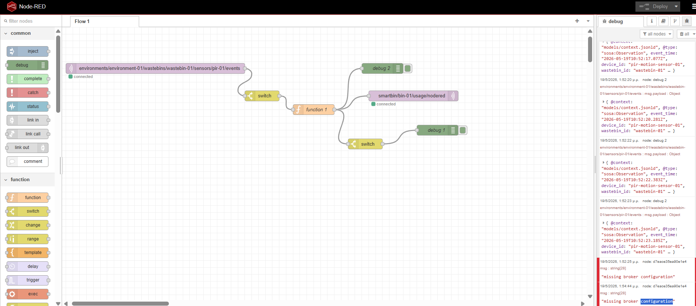
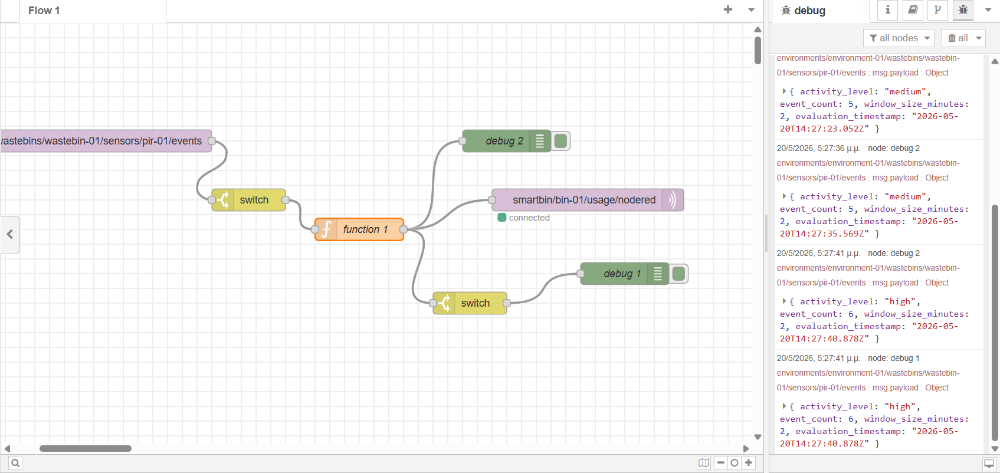

# Advanced Programming Techniques Lab

## Team Information

Members:

- Marios Ioannis Papadopoulos 1092834  
- Filippos Neofytos Theologos 1092633  
- Xristina Tzouda 1097346

---

# SECTION A - RUNBOOK

## Necessary hardware and software from previous labs

- Hardware:
  - Raspberry Pi 5
  - HC-SR501 PIR motion sensor
  - Jumper wires(female to female)
- Wiring the sensor:
  Use the example given on lab02, made sure to connect the OUT on the same pin.
- Connection
  Due to bad connection, we weren't able to download `homeassistant` during lab time and by using ssh, so we worked on the raspberry.
- Software:
  - The PIR sensor logic (`sampler.py`, `interpreter.py`) is reused from Lab 02 and extended with taking in consideration the off/clear state and placed it inside `pirlib/`.
  - Install Mosquitto brocker. Instructions givel on lab06
  - Installed Home Assistant and made our own dashboard.
  - Created our own API. Details given on lab08
  - Created and trained our own model in order to predict how busy some hours will be and send a notification on home assistant. Details given on lab09

## Part 1 — Install and run Node-RED

- Install Node-RED on the Raspberry Pi using the following command:

```
bash <(curl -sL https://raw.githubusercontent.com/node-red/linux-installers/master/deb/update-nodejs-and-nodered)
```

- Start Node-RED using the command:

```
node-red-start
```

- Access the Node-RED editor by navigating to `http://<192.168.157.222>:1880` in a web browser.(This is the ip of the laptop we used to connect to the raspberry pi via ssh)

## Part 2 — Hello World: your first flow

Following the instructions given on the lab website we were able to create our first flow.

![Node-RED flow editor showing a simple Hello World flow with an inject node connected to a debug node; editor UI includes flow canvas, left node palette, and right sidebar with flow properties and debug output; no prominent emotional tone].

## Part 3 — Subscribe to your pipeline

Following the instructions given on the lab website we were able to connect Node-RED to our existing MQTT pipeline. Node-RED will subscribe to the same topic as our existing pipeline and will receive the same messages.

Start `producer.py` in a terminal by running:

```
python producer.py --broker localhost --topic smartbin/bin-01/pir-01/events --pin 17
```

Output :

![Terminal and Node-RED debug panel showing incoming MQTT messages from producer script; left side shows terminal command and output, right side shows Node-RED debug window with message payloads and timestamps; environment is a developer workstation].

## Part 4 — Build a usage monitor flow

Following the pseudocode given on the lab website we were able to write the needed code in order to be able to to count how many “detected” events arrive in a rolling window.

### Deploy and test

- Started our producer and trigger motion events. You were able to see usage level updates in the debug panel.
- The retained message was visible on the MQTT topic `mosquitto_sub -h localhost -t "smartbin/bin-01/usage/nodered` as shown below:

![MQTT retained message displayed via mosquitto_sub showing topic smartbin/bin-01/usage/nodered and a JSON payload with usage metrics; background is terminal window on a laptop].

- Screenshot of the output:

![Node-RED debug sidebar displaying usage level updates over time as text messages from a rolling window counter; UI elements include message list and timestamps, set in the Node-RED editor environment].

## Part 5 — Add an email or notification alert

### Option A: Using a notification node

- The flow  

![Node-RED flow panel showing a notification node connected to the usage monitor flow; flow canvas, nodes labeled with types and simple wiring visible; workspace of Node-RED editor].

- The alert
![Home Assistant notification card showing an alert message triggered by Node-RED; card includes header and notification text describing high usage event; displayed within Home Assistant dashboard UI].

### Option B: Using an HTTP request to an external service

![Node-RED flow screenshot illustrating an HTTP request node configured to call an external notification service as part of the alerting branch; shows flow canvas and connected nodes].

### Option C: Publish alert to Home Assistant

- The flow

![Node-RED flow showing nodes that publish alerts to Home Assistant via MQTT or API, with nodes labeled for topic and payload; editor canvas and node wiring visible].

- The alert in Home Assistant
![Home Assistant dashboard displaying an alert notification generated by Node-RED; includes timestamp, entity name, and alert text inside the dashboard layout].

## Part 6 — Build a data routing flow

- Following the instruction on the lab website we created a flow that takes motion events and sends them to different places depending on their content.

![Node-RED flow demonstrating data routing logic that inspects motion event messages and forwards them to different outputs based on content; shows multiple branches and node labels indicating destinations].

## Part 7 — Install and use dashboard nodes

- Following the instructions on the lab website we installed the dashboard nodes and created a dashboard that shows the usage level of the smart bin.
-  Connect to the dashboard at `http://<192.168.157.222>:1880/ui` .
- The flow:
![Node-RED dashboard flow canvas showing nodes used to feed a real time usage level gauge; includes dashboard group and UI nodes connected to data sources].
- The dashboard:
![Web dashboard UI displaying a gauge or chart visualizing smart bin usage level over time, with labels and numeric values; the environment is a browser showing the Node-RED dashboard page].

## Part 8 — Export your flows

- Examples from our exported flows:

```
{"@context":"models/context.jsonld","@type":"sosa:Observation","event_time":"2026-05-22T11:12:39.607Z","device_id":"pir-motion-sensor-01","wastebin_id":"wastebin-01","environment_id":"environment-01","event_type":"motion","motion_state":"detected","seq":1,"run_id":"97e04e2a-3129-4f4e-8c27-d2b8cf9d4e92"}
{"@context":"models/context.jsonld","@type":"sosa:Observation","event_time":"2026-05-22T11:12:45.013Z","device_id":"pir-motion-sensor-01","wastebin_id":"wastebin-01","environment_id":"environment-01","event_type":"motion","motion_state":"detected","seq":2,"run_id":"97e04e2a-3129-4f4e-8c27-d2b8cf9d4e92"}
{"@context":"models/context.jsonld","@type":"sosa:Observation","event_time":"2026-05-22T11:12:50.020Z","device_id":"pir-motion-sensor-01","wastebin_id":"wastebin-01","environment_id":"environment-01","event_type":"motion","motion_state":"detected","seq":3,"run_id":"97e04e2a-3129-4f4e-8c27-d2b8cf9d4e92"}
{"@context":"models/context.jsonld","@type":"sosa:Observation","event_time":"2026-05-22T11:12:57.630Z","device_id":"pir-motion-sensor-01","wastebin_id":"wastebin-01","environment_id":"environment-01","event_type":"motion","motion_state":"detected","seq":4,"run_id":"97e04e2a-3129-4f4e-8c27-d2b8cf9d4e92"}
{"@context":"models/context.jsonld","@type":"sosa:Observation","event_time":"2026-05-22T11:13:29.967Z","device_id":"pir-motion-sensor-01","wastebin_id":"wastebin-01","environment_id":"environment-01","event_type":"motion","motion_state":"detected","seq":5,"run_id":"97e04e2a-3129-4f4e-8c27-d2b8cf9d4e92"}
```

# SECTION B - REPORT

## RQ1

- In Python: the unit of work is usually a function/class.
- In Node-RED: the unit of work is usually a node, a processing step, connected into a flow.
Node-RED = flow/event-driven, when a message arrives, pass it through these nodes
In Node-RED:
- node ≈ small function
- flow ≈ whole application/workflow
- message (msg) ≈ the data being passed around

## RQ2

In Node-RED, msg is the message object passed between nodes. `msg.payload` is the main data being processed. All nodes use `msg.payload` by convention, so nodes can work together consistently.

## RQ3

In Node-RED, the Deploy button publishes your flow changes to the running system.

## RQ4




- `wastebins/wastebin-01/sensors/pir-01/events`: Receives sensor events and Sends data into the flow as msg.payload.
- `switch node`: Filters or routes incoming messages and decides which messages continue into processing.
- `function node`: It is the main processing logic. It converts data and outputs the modified msg.
- `Debug node`(debug 2): Shows processed message in the debug panel and is used to inspect results.
- `smartbin/bin-01/usage/nodered`: Sends processed data back out to MQTT.
- `Second Switch node`: It Further filters processed data.
- `Debug node`(debug 1): Shows filtered results in the debug panel for inspection.

## RQ5

In Node-RED, `flow.set` stores a value in the flow memory, and `flow.get` retrieves it. They are similar to Python variables because both store data. The main difference is that a normal python varable exists onle when the code runs, while `flow.set` keeps the value between executions of the Function node.

## RQ6

The Node-RED works similarly to a Python `if` statement because it checks conditions and decides what happens next. However, the Switch node does this visually by routing messages through different outputs instead of using code. The visual approach makes workflows easier to understand, debug, and maintain, especially in larger systems.

## RQ7

The Node-Red flow is more easier to understand than an if/else python script because it is visual and shows the data flow clearly. In a Python script, you have to read through lines of code to understand the logic, while in Node-RED, you can see how messages move through nodes at a glance. This makes it easier to identify where things happen and how different parts of the system interact.

## RQ8

In Node-RED and Python, multiple clients can subscribe to the same MQTT topic at the same time. The MQTT broker sends a copy of each message to every subscriber, so both the Python consumer and the Node-RED flow receive the same data independently. They do not interfere with each other unless they are publishing conflicting messages to the same topic.

## RQ9

The Python approach requires more lines of code but offers greater flexibility and control. Node-RED uses fewer code lines because logic is built visually with nodes. Node-RED is generally easier to modify and test since connections and message flows are visible in real time, making debugging simpler. It is also more accessible to beginners or non-programmers, while Python is better suited for users with programming experience.

## RQ10

Yes, Node-RED could replace the Python producer because Node-RED can directly read GPIO pins and publish MQTT messages without needing a separate Python script. This makes the system simpler and more visual.

## RQ11

+-------------------+
|   PIR Sensor      |
+---------+---------+
          |
          v
+-------------------+
| Python Producer   |
| (reads sensor &   |
| publishes MQTT)   |
+---------+---------+
          |
          v
     +-------------+
     | MQTT Broker |
     +------+------+ 
            |
   +--------+---------+
   |                  |
   v                  v
+---------------+   +------------------+
| Python        |   | Node-RED Flow    |
| Consumer      |   | (logic, routing, |
|               |   | automation)      |
+---------------+   +--------+---------+
                             |
               +-------------+-------------+
               |                           |
               v                           v
   +----------------------+   +-------------------+
   | Home Assistant       |   | REST API (Flask)  |
   | dashboards & rules   |   | external access   |
   +----------------------+   +-------------------+

## RQ12

Yes, a non-programmer could likely add this rule in Node-RED because the logic can be built visually. The flow would subscribe to the MQTT motion topic, use a `Switch` node to check working hours, and a `Trigger` or `Delay` node to detect 6 hours without movement. If no motion is received during that time, another node could publish an alert message or update Home Assistant. A `Debug` node could also help test the rule easily without writing  code.

## RQ13

Some limitations of Node-RED mentioned in the lecture are that large flows can become difficult to manage, complex logic is sometimes easier to write in code, and performance may be lower compared to optimized Python programs. Node-RED also depends heavily on visual organization, so debugging very large systems can become confusing. In this lab, a common limitation was that some advanced logic still required JavaScript inside Function nodes.

## RQ14

They will need to manually reconfigure the MQTT broker nodes in their Node-RED instance. Specifically, they must update the broker's address (IP address), port, and any authentication credentials (username/password) to match their own MQTT broker, since this connection information is not automatically transferred between different environments.

## RQ15

If two students edit the flow at the same time, merge conflicts may occur in the JSON file, even for small visual changes. In contrast, Python scripts are generally easier to merge because changes are more clearly separated, line by line.

## RQ16

Node-Red was a very fast tool for building what was needed and it was also easy to test our flow and find any mistakes. Howevr in a larger production system with more complex-logic, a Python script would be more trustworthy because it offers more control, scalability and better performance. Node-RED is great for prototyping and simple automations, but for a robust, large-scale system, Python would likely be the better choice.

## RQ17

Yes, Node-Red allows more people to contribute to the project because the workflows are created visually, by just connecting nodes together. Someone without programming experience can understand and modify the flow, like a facility manager or a designer, while Python requires programming knowledge. 

## RQ18

- We would use Python scripts for:

1. the producer and consumer because it would be more efficient and easier to manage as it requires complex logic, like reading sensors and processing sensor data.
2. the REST API because Python provides better performance, flexibility, and control.

- We would use Node-RED for:

1. the automation rules and dashboard because it allows quick visual development and easy testing without needing to write code.
2. the MQTT routing and integration with Home Assistant because it can be easily modified and understood by non-programmers, making it more accessible for future maintenance and updates.


